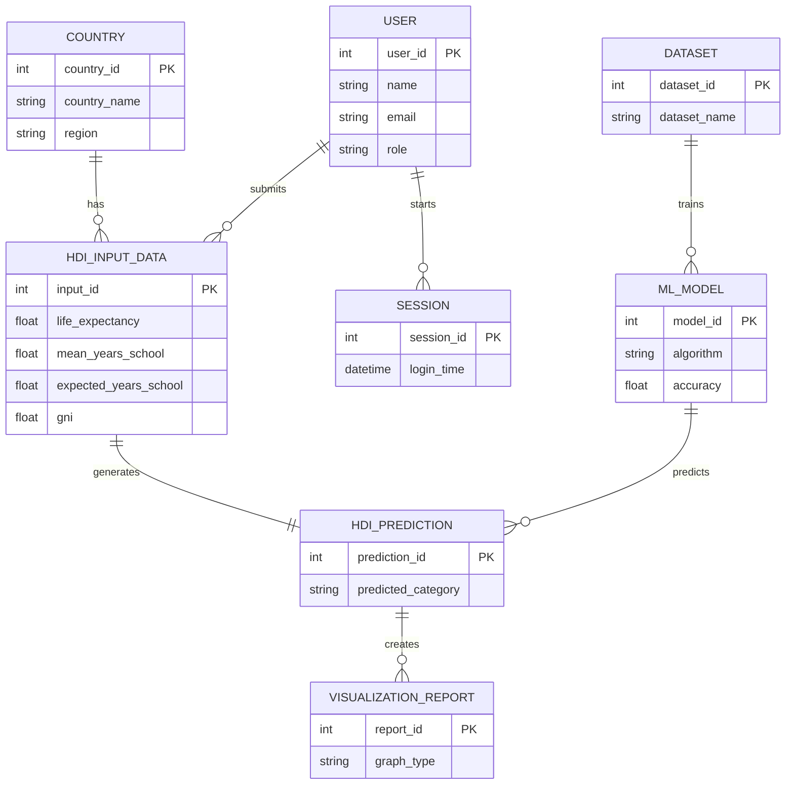
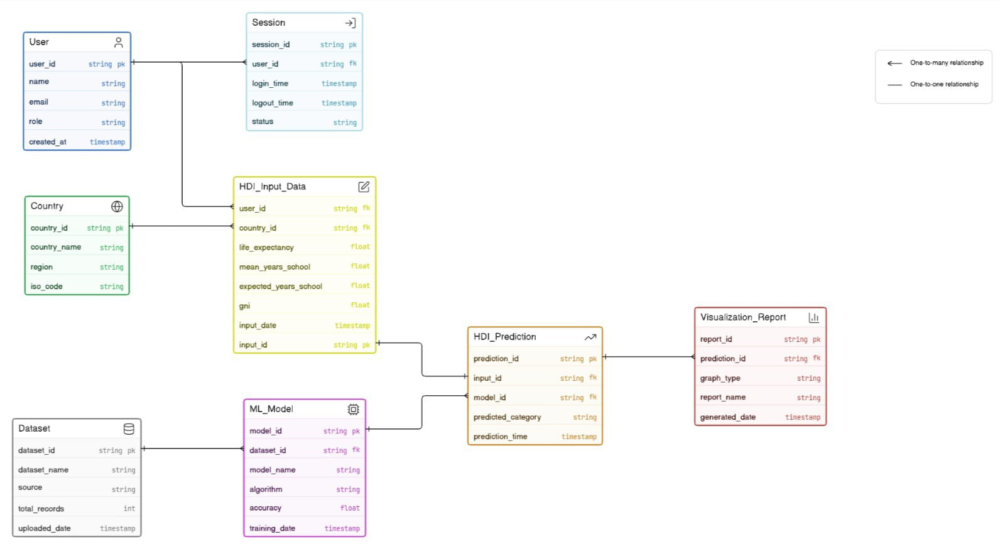
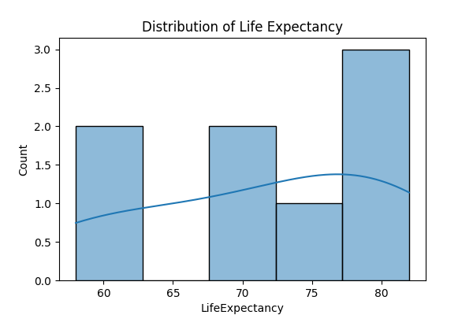
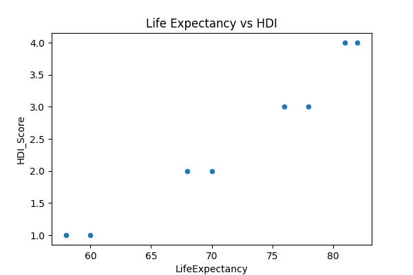
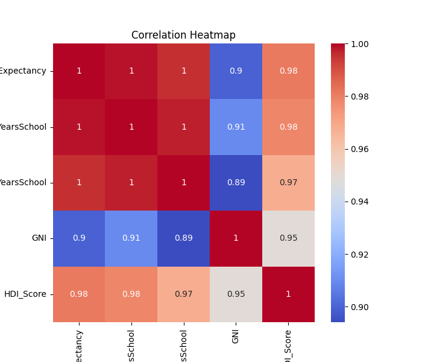
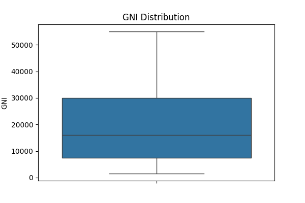
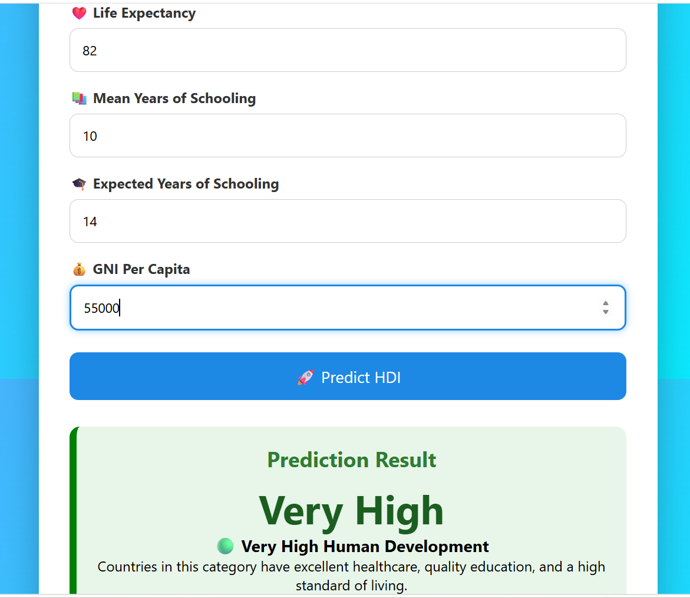

# 🌍 Human Development Index (HDI) Prediction

## 📌 Project Overview
This project predicts the Human Development Index (HDI) category of a country using Machine Learning. It uses a Random Forest Classifier trained on HDI-related indicators and provides predictions through a Flask web application.

## 🚀 Features
- Predicts HDI category from user inputs
- Interactive web interface built with Flask
- Fast and accurate Random Forest model
- User-friendly design

## 🛠 Technologies Used
- Python
- Flask
- Scikit-learn
- Pandas
- NumPy
- HTML
- CSS
- Joblib

## 📂 Dataset
The model is trained using the `hdi.csv` dataset.

### Input Features
- Life Expectancy
- Mean Years of Schooling
- Expected Years of Schooling
- GNI Per Capita

### Output
The model predicts one of the following categories:
- 🟢 Very High
- 🟡 High
- 🟠 Medium
- 🔴 Low

## ▶️ Installation

Clone the repository:

```bash
git clone https://github.com/Subhiksha-HS/HDI-Prediction.git
```

Install dependencies:

```bash
pip install -r requirements.txt
```

Run the application:

```bash
python app.py
```

Open your browser and visit:

```
http://127.0.0.1:5000
```

## 📁 Project Structure

```
HDI-Prediction/
│── app.py
│── model.py
│── hdi.csv
│── hdi_model.pkl
│── requirements.txt
│── README.md
│
├── templates/
│   └── index.html
│
└── static/
    ├── style.css
    └── hdi.png
```
## Entity Relationship (ER) Diagram

The following ER diagram represents the conceptual database design for the Human Development Index (HDI) Prediction System.


## Entity Relationship (ER) Diagram


## Data Visualization

This project includes exploratory data analysis using Matplotlib and Seaborn.

### Graphs

- Distribution of Life Expectancy
- Life Expectancy vs HDI
- Correlation Heatmap
- GNI Distribution (Box Plot)

### Outputs









## Project Output



## Data Preprocessing

The dataset was preprocessed before model training by performing the following steps:

- Loaded the HDI dataset using Pandas.
- Checked for missing (null) values.
- Removed missing records using `dropna()`.
- Selected the independent variables:
  - Life Expectancy
  - Mean Years of Schooling
  - Expected Years of Schooling
  - Gross National Income (GNI)
- Selected the dependent variable:
  - HDI Category
- Applied Label Encoding to convert categorical HDI labels into numerical values.
- Split the dataset into training and testing sets using an 80:20 ratio.

## 🎥 Demo Video

Watch the complete project demonstration here:

**🔗 Demo Video:**  
https://drive.google.com/file/d/118ijjQp7VncXVvQUqEN9wlnky4swBv40/view?usp=drivesdk
## 👩‍💻 Author

**Subhiksha H.S.**
- GitHub: https://github.com/Subhiksha-HS

